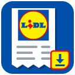

<p align="center">
  
</p>

<h1 align="center">Kassensturz</h1>

<p align="center">
  <b>Alle deine Lidl Plus Kassenbons. Ein Klick. Fertig.</b><br>
  PDF, JSON und CSV – sauber sortiert in deinem Download-Ordner.
</p>

<p align="center">
  <a href="https://addons.mozilla.org/de/firefox/addon/kassensturz-kassenbon-export-f/"></a>
  
  
  
</p>

---

Lidl Plus speichert jeden deiner Einkäufe als digitalen Bon. Nur: rausbekommen musst du sie einzeln, Bon für Bon, Klick für Klick.

**Kassensturz holt sie alle auf einmal.** Zeitraum wählen, Start drücken, zurücklehnen. Nach wenigen Minuten liegt jeder Bon als PDF und als Datensatz auf deiner Festplatte.

## 🧾 Perfekt für die Steuererklärung

Werkzeug, Büromaterial, Druckerpapier, Elektronik aus dem Non-Food-Regal: vieles davon kannst du als Arbeitsmittel oder Betriebsausgabe absetzen. Dafür brauchst du den Beleg.

Mit Kassensturz hast du alle Belege des Jahres mit einem Klick zusammen:

- Zeitraum auf **„Letztes Jahr"** stellen, Start.
- Jeder Bon als **PDF**, fertig zum Abheften oder Hochladen ins Steuerprogramm.
- In der **CSV** suchst du per Filter genau die Artikel raus, die du absetzen willst.

Kein Suchen in der App, kein Abfotografieren von verblassten Thermopapier-Bons.

## ✨ Was du bekommst

| | |
|---|---|
| 📄 **PDF pro Bon** | Sieht aus wie die Bonkopie auf lidl.de: Logo, Artikel, Rabatte, Barcode. Text auswählbar und durchsuchbar. |
| 🗂️ **JSON pro Bon** | Jeder Artikel mit Menge, Einzelpreis, Rabatten und MwSt-Satz, dazu Zahlungsart und eingelöste Coupons. |
| 📊 **CSV mit allem** | Alle Artikel aller Bons in einer Tabelle. Öffnet direkt in Excel oder LibreOffice. |
| 📅 **Zeitraum-Filter** | Von/Bis im Format TT.MM.JJJJ oder per Schnellwahl: Dieser Monat, Letzter Monat, 30 Tage, Dieses Jahr, Letztes Jahr, Alles. |
| ⚡ **Schnell** | Mehrere Bons laden parallel. Jeder Bon wird sofort gespeichert, nicht erst am Ende. |

Alles landet ordentlich sortiert:

```
Downloads/lidl-bons-2026-09-26_1630/
├── pdf/    2025-02-01_1506_Germering_24,83EUR.pdf …
├── json/   2025-02-01_1506_Germering_24,83EUR.json …
├── _alle-artikel.csv
└── _alle.json
```

## 🔒 Deine Daten bleiben deine Daten

Kassensturz sammelt nichts, schickt nichts und hat keinen Server. Die Extension liest deine Bons direkt auf lidl.de mit deinem bestehenden Login und speichert sie lokal. Der komplette Quellcode liegt hier im Repo.

## 🚀 So geht's

1. [Kassensturz für Firefox installieren](https://addons.mozilla.org/de/firefox/addon/kassensturz-kassenbon-export-f/)
2. Auf [lidl.de](https://www.lidl.de) einloggen.
3. Unten rechts auf das Kassensturz-Icon klicken.
4. Zeitraum wählen, **Start**. Fertig.

Mit **Ordner öffnen** springst du direkt zu den Dateien.

## 🛠️ Entwicklung

Ein Quellcode, zwei Browser:

```
src/                   Code, Icons, jsPDF (gemeinsam für alle Browser)
src-chrome/            nur Chrome: Service-Worker-Einstieg, Offscreen-Dokument für große Downloads
manifests/base.json    gemeinsame Manifest-Einträge
manifests/firefox.json Firefox-Teil (background.scripts, Gecko-ID)
manifests/chrome.json  Chrome-Teil (background.service_worker, offscreen)
scripts/build.mjs      baut build/<browser>/ und dist/*.zip
dev/                   Vorschau-Seiten, Quell-Logo
```

```bash
npm run build          # Firefox + Chrome
npm run lint:firefox   # web-ext lint auf build/firefox
npm run check:chrome   # lädt build/chrome in headless Chromium
```

Temporär laden:
- **Firefox:** `about:debugging` → *Dieser Firefox* → *Temporäres Add-on laden* → `build/firefox/manifest.json`
- **Chrome:** `chrome://extensions` → Entwicklermodus → *Entpackte Erweiterung laden* → `build/chrome/`

`dev/preview-ui.html` zeigt das Widget ohne Extension-Umgebung (Datei im Browser öffnen).

Drittanbieter: [jsPDF](https://github.com/parallax/jsPDF) 2.5.1 (MIT), unverändert.

---

<sub>Kassensturz ist ein inoffizielles Projekt und nicht mit Lidl verbunden. „Lidl" und „Lidl Plus" sind Marken ihrer jeweiligen Inhaber. Keine Steuerberatung: was du absetzen kannst, klärst du mit deinem Steuerprogramm oder Steuerberater.</sub>

<sub>Lizenz: MIT</sub>
